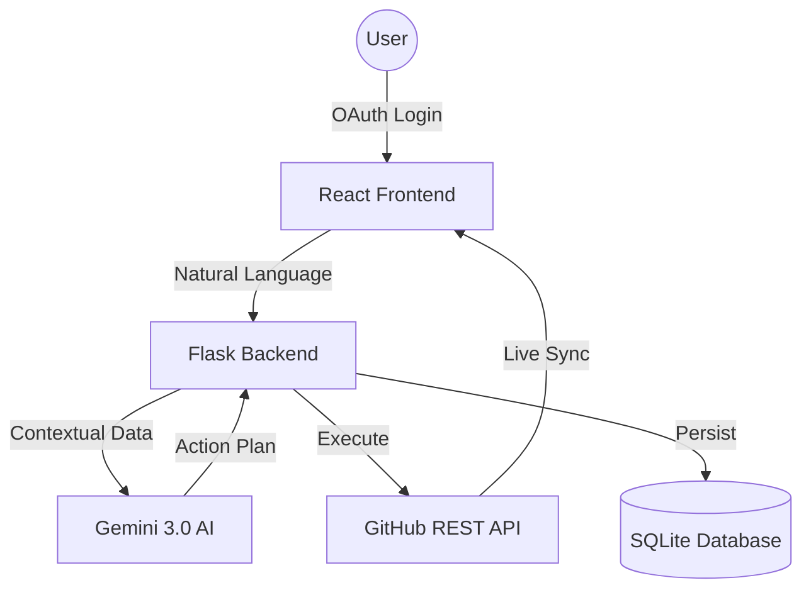

# 📊 Portfolio Case Study: IssueAgent AI

## 📝 Problem Statement
Open-source maintainers and large engineering teams are often overwhelmed by "issue fatigue." Triage — the process of reading, labeling, prioritizing, and assigning new issues — is a repetitive manual task that delays actual development work.

## 💡 Solution
IssueAgent is an **Autonomous GitHub Management System** that acts as a bridge between GitHub repositories and the Gemini 3.0 Large Language Model. It handles the "administrative overhead" of issue management, allowing developers to focus strictly on code.

## 🛠️ Tech Stack
- **AI**: Gemini 3.0 Flash Lite (via Google Generative AI SDK)
- **Frontend**: React, Vite, Framer Motion (for high-fidelity animations)
- **Backend**: Python Flask, SQLAlchemy
- **Database**: SQLite / PostgreSQL
- **Auth**: GitHub OAuth 2.0
- **API**: GitHub REST API v3

## 🧩 Architecture Diagram

## 🧠 Challenges Solved
1.  **AI Hallucination Control**: Implemented strict JSON schema parsing for Gemini responses to ensure AI-generated "action plans" could be programmatically executed without errors.
2.  **State Management**: Synchronizing real-time GitHub issue states with local database caching to minimize API rate-limiting while maintaining a fast UI.
3.  **Auditability**: Designed a robust "Undo" system by logging the inverse of every GitHub action, allowing users to safely experiment with AI automation.

## 📈 Learnings
- **Prompt Engineering**: Refined prompts to handle bulk issue data efficiently within the Gemini context window.
- **OAuth Complexity**: Managed secure token exchange and persistence for a seamless single-sign-on experience.
- **UX for AI**: Built a chat interface that provides "Explainable AI" — showing the user the agent's plan before execution.

## 💼 Resume Bullet
> "Developed an AI-powered GitHub Issues Manager Agent using React, Tailwind CSS, Flask, SQLite, GitHub OAuth, and Gemini 3.0 to automatically analyze, prioritize, label, assign, and manage repository issues through natural language commands."

---

[View Project Repository](https://github.com/yourusername/github-issue-agent) | [Live Demo](https://issue-agent-demo.vercel.app)
